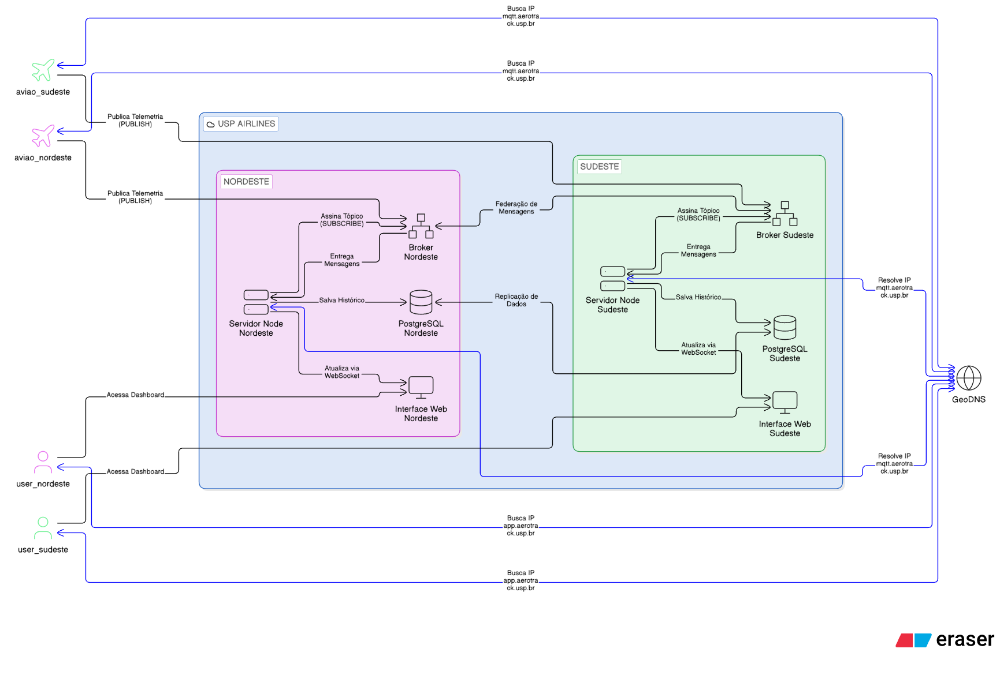

# ✈ USP Airlines — Sistema Distribuído de Rastreamento de Aviões

### Projeto de Sistemas Distribuídos · MQTT · Docker · Leaflet · Cassandra · GeoDNS

---

## Arquitetura

O sistema é dividido em **5 regiões geográficas do Brasil**: Sul, Sudeste, Norte, Nordeste e Centro-Oeste. Cada região tem seu broker MQTT, seu servidor de aplicação e seu nó Cassandra. Um serviço de **GeoDNS** escolhe dinamicamente o broker regional mais adequado e faz failover quando necessário.



### Como o GeoDNS funciona

Cada avião e cada servidor de aplicação consulta `GET /resolver?lat=..&lon=..` no GeoDNS. O serviço mapeia a coordenada para uma das 5 regiões, verifica se o broker daquela região está ativo em `brokers-ativos.json` e valida a saúde da conexão via TCP na porta `1883`. Se a região principal estiver indisponível, o GeoDNS faz failover para o próximo broker ativo disponível.

## Modelos de Sistemas Distribuídos Aplicados

| Modelo | Aplicação no projeto |
|---|---|
| Pub/Sub baseado em eventos | Aviões publicam; servidores e frontend assinam sem acoplamento direto |
| Cliente-servidor multicamadas | Frontend → Servidor → Banco, com instâncias por região |
| Redes de sensores | Cada container de avião age como um nó autônomo |
| Middleware de mensageria | Mosquitto abstrai transporte, roteamento e QoS |
| Descoberta de serviço | GeoDNS resolve dinamicamente qual broker usar |
| Replicação de dados | Cassandra é usado por região no modo completo |

## Tópicos MQTT e QoS

| Tópico | Publisher | QoS | Retained | Uso |
|---|---|---:|---|---|
| `voo/{iata_airline}/{callsign}/telemetria` | Avião | 0 | Sim | Posição em tempo real |
| `voo/eventos` | Avião | 1 | Não | Decolagem, pouso, emergência e desconexão |
| `controle/{callsign}` | Operador | 1 | Não | Comandos remotos ao avião |

Cada servidor regional assina `voo/+/+/telemetria` com QoS 0 e `voo/eventos` com QoS 1 no seu broker local.

### Justificativa das escolhas

- QoS 0 é suficiente para telemetria, porque dados antigos perdem valor rapidamente.
- QoS 1 é usado para eventos porque perder um evento de ciclo de vida gera inconsistência.
- Retained messages ajudam novos clientes a enxergar o estado atual imediatamente.

## Como Executar o Projeto

O projeto tem **dois modos de execução**, escolhidos pelo arquivo `docker-compose` usado no comando.

### Pré-requisitos

- Docker 24+
- Docker Compose v2

### Modo `dev`

Sobe apenas a região Sudeste, além do GeoDNS, frontend e os aviões.

```bash
docker compose -f docker-compose.dev.yml up --build
```

### Modo `full`

Sobe as 5 regiões, com broker, servidor e Cassandra próprios em cada uma.

```bash
docker compose -f docker-compose.full.yml up --build
```

### Acesso

Depois de subir os containers, acesse:

| Serviço | Endereço |
|---|---|
| Frontend | `http://localhost:3000` |
| GeoDNS | `http://localhost:18080` |
| API da região Sudeste no modo `dev` | `http://localhost:4002` |

No modo `full`, cada região expõe sua própria porta:

| Região | Porta REST | Porta MQTT |
|---|---|---|
| Sul | `http://localhost:4001` | `mqtt://localhost:1891` |
| Sudeste | `http://localhost:4002` | `mqtt://localhost:1892` |
| Norte | `http://localhost:4003` | `mqtt://localhost:1893` |
| Nordeste | `http://localhost:4004` | `mqtt://localhost:1894` |
| Centro-Oeste | `http://localhost:4005` | `mqtt://localhost:1895` |

Se abrir o sistema por um hostname da rede em vez de `localhost`, use esse mesmo hostname no navegador. O frontend usa o hostname atual para falar com o GeoDNS e com o servidor regional.

### API REST

| Endpoint | Descrição |
|---|---|
| `GET /status` | Métricas do servidor: voos, mensagens, WebSocket, uptime e memória |
| `GET /voos` | Estado atual de todos os voos em memória |
| `GET /voos/{callsign}` | Estado de um voo específico |
| `GET /historico/{callsign}` | Últimas 100 posições persistidas no Cassandra |
| `GET /eventos` | Últimos 50 eventos de ciclo de vida |

## Scripts de Teste

```bash
chmod +x scripts/*.sh

# Adicionar avião dinamicamente
./scripts/add-aviao.sh LA9999 LATAM LA GRU POA 1000

# Teste de crash failures
./scripts/crash-test.sh

# Injetar latência de rede
./scripts/network-delay.sh inject 500ms 100ms 10
./scripts/network-delay.sh remove
./scripts/network-delay.sh status
```

## Estrutura do Projeto

```text
projeto-flightradar/
├── aviao/
│   ├── simulator.js
│   ├── package.json
│   └── Dockerfile
├── banco/
│   └── init.sql
├── broker/
│   ├── mosquitto.conf
│   ├── mosquitto.dev.conf
│   └── Dockerfile
├── frontend/
│   ├── index.html
│   ├── nginx.conf
│   └── Dockerfile
├── geodns/
│   ├── server.js
│   ├── package.json
│   └── brokers-ativos.json
├── scripts/
│   ├── add-aviao.sh
│   ├── crash-test.sh
│   └── network-delay.sh
├── servidor/
│   ├── server.js
│   ├── package.json
│   └── Dockerfile
├── docker-compose.dev.yml
├── docker-compose.full.yml
├── assets/
│   └── diagrama_arquitetura.png
└── README.md
```

## Decisões de projeto

| Decisão | Motivo |
|---|---|
| Mosquitto como broker real | Mantém o projeto aderente ao uso de middleware de mensageria |
| GeoDNS por região | Permite roteamento por localização e failover |
| Estado em memória no servidor | Reduz dependência do banco para o estado corrente |
| Persistência amostrada | Evita escrita excessiva sem perder histórico útil |
| Retained messages | Novos clientes recebem contexto imediatamente |
| Last Will Testament | Notifica falhas de forma automática |

## Notas técnicas

- O servidor cria as tabelas em Cassandra na inicialização, usando o esquema de `banco/init.sql` como referência.
- O frontend exibe um snapshot inicial via WebSocket e depois acompanha eventos em tempo real.
- O projeto foi pensado para rodar localmente com Docker Compose, sem depender de serviços externos.

